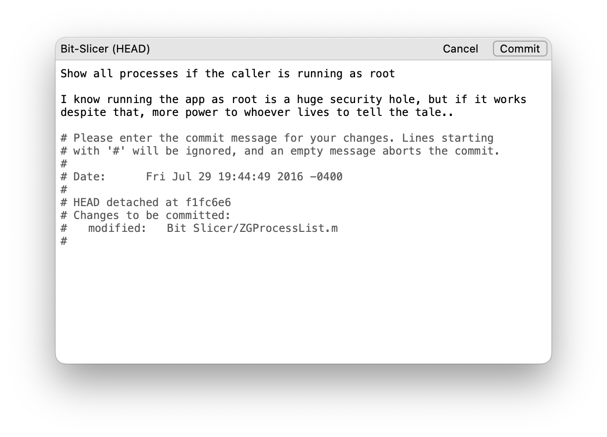

# Komet

A Cocoa text editor designed for creating commit messages.

[Download Komet](https://zgcoder.net/software/komet/Komet.dmg)

## Purpose

A commit editor shouldn't be stuck in an obstructive save-and-close model. Applying and discarding a commit should be convenient, and you shouldn't [think twice](https://stackoverflow.com/a/4323790) about it. The editor should also automate actions that make writing good messages possible.

After transitioning to Komet, I put less effort in creating higher quality messages and my margin of error has decreased.

## Features

* Single action for applying or discarding a commit (`⌘ ↩` > `<esc>:wq`)
* Double newline insertion after the first line.
* Cocoa's spell checking and automatic correction.
* Text highlight warning if line becomes too long for subject and/or body.
* Specialized text selection and font handling for message and comment sections.
* Intelligent discarding of commits (i.e, `exit(1)` only if commit file has pre-existing content).
* Ideal caret position on launch after the initial content.
* Support for committing using the Touch Bar.
* Resume off from canceled commit messages.

### Themes

## Requirements

**System Version**: macOS 10.10 or later

**Version Control**: git, hg, svn

For optimal behavior, Komet depends on being able to distinguish the commit message content and the comment section at the end of the file. Thus, Komet has a small bit of code for handling each of its supported version control systems.

## Contributing

If you enjoy using Komet and feel like something could improve, feel free to make a contribution. It is advisable to create an issue first before submitting a big change or to browse the current [issues](https://github.com/zorgiepoo/Komet/issues). Please also read and follow the code of conduct in the repository first before contributing.

Komet can now be translated to other languages. To translate Komet go in the Xcode Project settings and add a new language in the Localizations section. After the localization files have been created, modify the string values in each one. Skip translating string values in xibs that are underscored like  `project_name`. Finally, test the translation by changing your system language in System Preferences and by building and running Komet.
